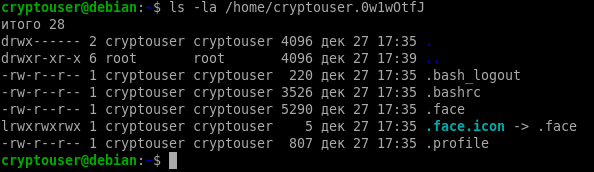
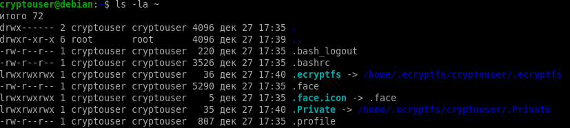
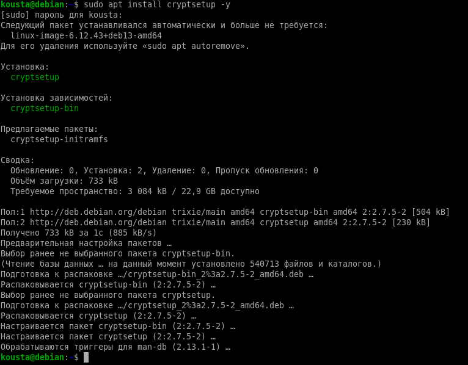
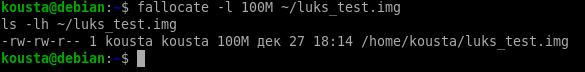
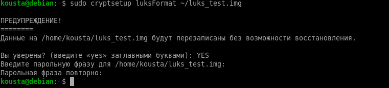
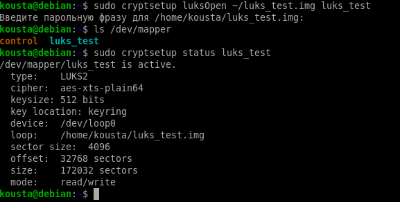
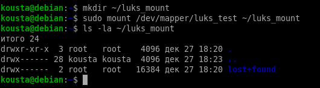
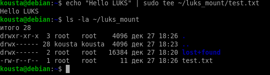
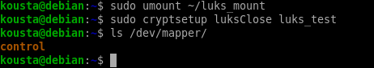

 Домашнее задание: Защита хоста

Студент: Морозов Константин

## Задание 1: eCryptfs
1. Установили eCryptfs:

```bash
sudo apt install ecryptfs-utils -y
```

2. Создали пользователя cryptouser:


```
sudo adduser cryptouser
```

3. Зашифровали домашний каталог:

```
sudo ecryptfs-migrate-home -u cryptouser
```

Скриншоты:

до шифрования:



после шифрования:



## Шифрование раздела с помощью LUKS

1. Установка поддержки LUKS

Устанавливаем утилиту cryptsetup, необходимую для работы с LUKS:

```
sudo apt update
sudo apt install cryptsetup -y
```

Скриншот:


2. Создание зашифровываемого раздела (файл-образ 100 Мб)

Для выполнения задания используется файл-образ размером 100 Мб, который выступает в роли раздела:

```
fallocate -l 100M ~/luks_test.img
ls -lh ~/luks_test.img
```

Команда ls подтверждает создание файла нужного размера.

Скриншот:


3. Инициализация LUKS на созданном разделе

Шифруем созданный файл с помощью LUKS:

```
sudo cryptsetup luksFormat ~/luks_test.img
```

Подтверждаем операцию вводом YES и задаём пароль шифрования.

На этом этапе создаётся LUKS-контейнер, без ввода пароля данные будут недоступны.

Скриншот:


4. Открытие LUKS-контейнера

Открываем зашифрованный контейнер для работы:

```
sudo cryptsetup luksOpen ~/luks_test.img luks_test
```

После ввода пароля создаётся виртуальное устройство
/dev/mapper/luks_test

Проверка статуса контейнера:

```
ls /dev/mapper
sudo cryptsetup status luks_test
```

Скриншот:


5. Создание файловой системы на LUKS-разделе

Создаём файловую систему ext4 на расшифрованном устройстве:

```
sudo mkfs.ext4 /dev/mapper/luks_test
```

Этот шаг подтверждает, что зашифрованный раздел готов к хранению данных.

Скриншот:


6. Монтирование LUKS-раздела и работа с данными

Создаём точку монтирования и монтируем раздел:

```
mkdir ~/luks_mount
sudo mount /dev/mapper/luks_test ~/luks_mount
```

Проверяем содержимое (раздел пустой):

```
ls -la ~/luks_mount
```

Создаём тестовый файл внутри зашифрованного раздела:

```
echo "Hello LUKS" | sudo tee ~/luks_mount/test.txt
ls -la ~/luks_mount
```

Файл успешно создан, данные автоматически шифруются на уровне LUKS.

Скриншоты:

 

7. Отмонтирование и закрытие LUKS-контейнера

Корректно отключаем раздел и закрываем LUKS-контейнер:

```
sudo umount ~/luks_mount
sudo cryptsetup luksClose luks_test
```

Проверяем, что устройство удалено:

```
ls /dev/mapper
```

Отсутствие luks_test подтверждает, что контейнер закрыт и данные защищены.

Скриншот:

